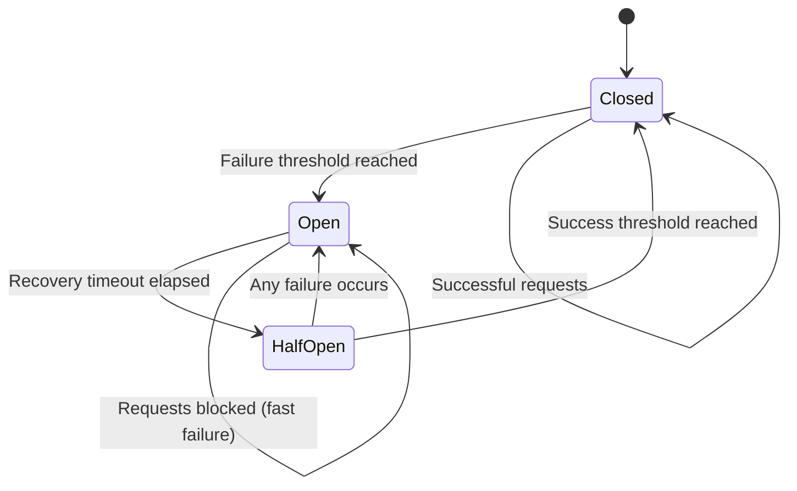

# MCP Circuit Breaker Documentation

The MCP Circuit Breaker implementation provides resilience against failing MCP servers by implementing the circuit breaker pattern. This helps prevent cascading failures and provides automatic recovery when services become available again.

## Overview

The circuit breaker pattern is a design pattern used to detect failures and encapsulates the logic of preventing a failure from constantly recurring during maintenance, temporary external system failure, or unexpected system difficulties.

### Key Benefits

- **Fast Failure**: Prevents waiting for timeouts when services are down
- **Automatic Recovery**: Tests service availability and recovers automatically
- **Cascading Failure Prevention**: Stops failures from propagating through the system
- **Resource Protection**: Prevents resource exhaustion from repeated failed calls
- **Monitoring**: Provides detailed metrics about service health

## Circuit Breaker States



### State Descriptions

1. **CLOSED**: Normal operation, requests pass through to the service
2. **OPEN**: Service is failing, requests fail fast without calling the service
3. **HALF_OPEN**: Testing if service has recovered, limited requests allowed

## Configuration

### Basic Configuration

```python
from graph_of_thoughts.language_models.mcp_circuit_breaker import CircuitBreakerConfig

config = CircuitBreakerConfig(
    failure_threshold=5,        # Failures before opening circuit
    recovery_timeout=30.0,      # Seconds to wait before testing recovery
    half_open_max_calls=3,      # Max calls allowed in half-open state
    success_threshold=2,        # Successes needed to close circuit
    monitoring_window=60.0,     # Time window for failure rate calculation
    minimum_throughput=10       # Min requests before considering failure rate
)
```

### Configuration in MCP Config File

```json
{
    "mcp_claude_desktop": {
        "transport": {
            "type": "stdio",
            "command": "claude-desktop"
        },
        "circuit_breaker": {
            "enabled": true,
            "failure_threshold": 5,
            "recovery_timeout": 30.0,
            "half_open_max_calls": 3,
            "success_threshold": 2,
            "monitoring_window": 60.0,
            "minimum_throughput": 10
        }
    }
}
```

## Usage Examples

### Basic Usage

```python
import asyncio
from graph_of_thoughts.language_models.mcp_circuit_breaker import MCPCircuitBreaker

async def example_usage():
    # Create circuit breaker
    circuit_breaker = MCPCircuitBreaker()
    
    # Use with async context manager
    try:
        async with circuit_breaker:
            result = await some_mcp_operation()
            print(f"Success: {result}")
    except CircuitBreakerOpenError:
        print("Service is currently unavailable")
    except Exception as e:
        print(f"Service error: {e}")
```

### Using the Call Method

```python
async def protected_operation():
    circuit_breaker = MCPCircuitBreaker()
    
    try:
        result = await circuit_breaker.call(mcp_transport.send_request, "method", params)
        return result
    except CircuitBreakerOpenError:
        # Handle fast failure
        return {"error": "Service unavailable"}
```

### Integration with MCP Client

The circuit breaker is automatically integrated with the MCP client when enabled in configuration:

```python
from graph_of_thoughts.language_models.mcp_client import MCPLanguageModel

# Circuit breaker is automatically applied if enabled in config
lm = MCPLanguageModel(
    config_path="mcp_config.json",
    model_name="mcp_claude_desktop"
)

# Check circuit breaker status
status = lm.get_circuit_breaker_status()
if status:
    print(f"Circuit state: {status['state']}")
    print(f"Service healthy: {status['is_healthy']}")
    print(f"Total requests: {status['total_requests']}")
    print(f"Success rate: {status['successful_requests'] / status['total_requests'] * 100:.1f}%")

# Check if service is healthy
if lm.is_service_healthy():
    response = await lm.query("What is AI?")
else:
    print("Service is currently unhealthy")
```

## Monitoring and Metrics

### Available Metrics

```python
metrics = circuit_breaker.get_metrics()

print(f"Total requests: {metrics.total_requests}")
print(f"Successful requests: {metrics.successful_requests}")
print(f"Failed requests: {metrics.failed_requests}")
print(f"Circuit opened count: {metrics.circuit_open_count}")
print(f"Current state: {metrics.current_state}")
print(f"Last failure time: {metrics.last_failure_time}")
print(f"State change time: {metrics.state_change_time}")
```

### State Checking

```python
# Check current state
if circuit_breaker.is_closed():
    print("Normal operation")
elif circuit_breaker.is_open():
    print("Service is down, failing fast")
elif circuit_breaker.is_half_open():
    print("Testing service recovery")

# Get detailed state
state = circuit_breaker.get_state()
print(f"Current state: {state.value}")
```

## Advanced Configuration

### Custom Exception Handling

```python
from graph_of_thoughts.language_models.mcp_transport import MCPConnectionError, MCPTimeoutError

config = CircuitBreakerConfig(
    expected_exceptions=(MCPConnectionError, MCPTimeoutError, ConnectionError),
    failure_threshold=3,
    recovery_timeout=15.0
)

circuit_breaker = MCPCircuitBreaker(config)
```

### Adaptive Configuration

```python
# Configuration for high-traffic scenarios
high_traffic_config = CircuitBreakerConfig(
    failure_threshold=10,
    recovery_timeout=60.0,
    half_open_max_calls=5,
    success_threshold=3,
    monitoring_window=120.0,
    minimum_throughput=50
)

# Configuration for critical services
critical_service_config = CircuitBreakerConfig(
    failure_threshold=2,
    recovery_timeout=10.0,
    half_open_max_calls=1,
    success_threshold=1,
    monitoring_window=30.0,
    minimum_throughput=5
)
```

## Transport Integration

The circuit breaker can be automatically applied to MCP transports:

```python
from graph_of_thoughts.language_models.mcp_circuit_breaker import wrap_transport_with_circuit_breaker

# Create base transport
transport = create_transport(config)

# Wrap with circuit breaker
protected_transport = wrap_transport_with_circuit_breaker(transport, config)

# Use protected transport
async with protected_transport:
    result = await protected_transport.send_request("method", params)
```

## Best Practices

### Configuration Guidelines

1. **Failure Threshold**: Set based on expected failure patterns
   - Low threshold (2-3) for critical services
   - Higher threshold (5-10) for less critical services

2. **Recovery Timeout**: Balance between quick recovery and avoiding flapping
   - Short timeout (10-30s) for transient issues
   - Longer timeout (60-300s) for maintenance windows

3. **Half-Open Calls**: Limit to avoid overwhelming recovering services
   - 1-3 calls for most scenarios
   - Higher for high-throughput services

### Monitoring Recommendations

1. **Alert on Circuit Opens**: Monitor `circuit_open_count` metric
2. **Track Success Rates**: Monitor overall success/failure ratios
3. **Recovery Time**: Track time between open and closed states
4. **False Positives**: Monitor for circuits opening due to transient issues

### Error Handling

```python
async def robust_mcp_operation():
    try:
        async with circuit_breaker:
            return await mcp_operation()
    except CircuitBreakerOpenError:
        # Service is down, use fallback or cache
        return get_cached_response()
    except Exception as e:
        # Handle other errors
        logger.error(f"MCP operation failed: {e}")
        raise
```

## Testing

### Unit Testing with Circuit Breaker

```python
import unittest
from unittest.mock import AsyncMock

class TestWithCircuitBreaker(unittest.TestCase):
    async def test_circuit_breaker_protection(self):
        mock_service = AsyncMock()
        mock_service.side_effect = ConnectionError("Service down")
        
        circuit_breaker = MCPCircuitBreaker(CircuitBreakerConfig(failure_threshold=2))
        
        # Generate failures to open circuit
        for _ in range(2):
            with self.assertRaises(ConnectionError):
                await circuit_breaker.call(mock_service)
        
        # Circuit should now block calls
        with self.assertRaises(CircuitBreakerOpenError):
            await circuit_breaker.call(mock_service)
```

### Integration Testing

```python
async def test_mcp_with_circuit_breaker():
    config = {
        "circuit_breaker": {
            "enabled": True,
            "failure_threshold": 3,
            "recovery_timeout": 5.0
        }
    }
    
    lm = MCPLanguageModel(config=config)
    
    # Test normal operation
    response = await lm.query("Test query")
    assert response is not None
    
    # Check circuit breaker status
    status = lm.get_circuit_breaker_status()
    assert status["state"] == "closed"
    assert status["is_healthy"] is True
```

## Troubleshooting

### Common Issues

1. **Circuit Opens Too Frequently**
   - Increase `failure_threshold`
   - Increase `monitoring_window`
   - Check for transient network issues

2. **Circuit Doesn't Open When Expected**
   - Decrease `failure_threshold`
   - Check `expected_exceptions` configuration
   - Verify minimum throughput requirements

3. **Slow Recovery**
   - Decrease `recovery_timeout`
   - Decrease `success_threshold`
   - Increase `half_open_max_calls`

### Debug Logging

Enable debug logging to see circuit breaker activity:

```python
import logging
logging.getLogger('graph_of_thoughts.language_models.mcp_circuit_breaker').setLevel(logging.DEBUG)
```

### Metrics Analysis

```python
def analyze_circuit_breaker_health(circuit_breaker):
    metrics = circuit_breaker.get_metrics()
    
    if metrics.total_requests == 0:
        return "No requests processed"
    
    success_rate = metrics.successful_requests / metrics.total_requests
    
    if success_rate > 0.95:
        return "Healthy"
    elif success_rate > 0.8:
        return "Degraded"
    else:
        return "Unhealthy"
```

## Performance Considerations

- Circuit breaker adds minimal overhead (~1-2ms per request)
- Memory usage scales with monitoring window size
- Async operations are fully supported
- Thread-safe for concurrent access

## Future Enhancements

- Adaptive thresholds based on historical data
- Integration with external monitoring systems
- Custom recovery strategies
- Distributed circuit breaker coordination
