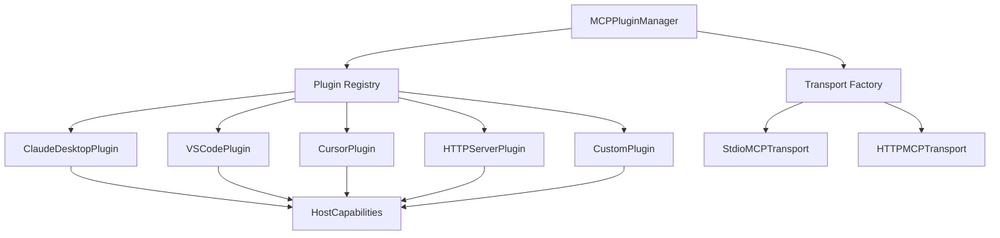

# MCP Plugin System Documentation

The MCP Plugin System provides an extensible architecture for supporting different MCP host implementations without modifying core transport code. This system enables better maintainability, extensibility, and host-specific optimizations.

## Overview

The plugin system consists of several key components:

- **MCPHostPlugin**: Abstract base class for implementing host-specific plugins
- **HostCapabilities**: Dataclass defining what features each host supports
- **MCPPluginManager**: High-level interface for managing plugins and configurations
- **Plugin Registry**: Global registry for discovering and accessing plugins

## Architecture



## Built-in Plugins

### Claude Desktop Plugin
- **Host Name**: `claude_desktop`
- **Transport**: stdio
- **Capabilities**: Tools, Resources, Prompts, Sampling
- **Command**: `claude-desktop-mcp-server`

### VS Code Plugin
- **Host Name**: `vscode`
- **Transport**: stdio
- **Capabilities**: Tools, Resources, Prompts, Sampling, Roots, Discovery
- **Command**: `code --mcp-server`

### Cursor Plugin
- **Host Name**: `cursor`
- **Transport**: stdio
- **Capabilities**: Tools, Sampling
- **Command**: `cursor --mcp-server`

### HTTP Server Plugin
- **Host Name**: `http_server`
- **Transport**: HTTP
- **Capabilities**: Tools, Resources, Prompts, Sampling, Discovery
- **Authentication**: Bearer, Basic, OAuth2

## Usage Examples

### Basic Plugin Manager Usage

```python
from graph_of_thoughts.language_models.mcp_plugin_manager import MCPPluginManager

# Create plugin manager
manager = MCPPluginManager()

# List available hosts
hosts = manager.list_hosts()
print(f"Available hosts: {hosts}")

# Get host capabilities
capabilities = manager.get_host_capabilities("claude_desktop")
print(f"Claude Desktop supports tools: {capabilities.supports_tools}")

# Generate configuration template
template = manager.generate_config_template("vscode")
print(template)
```

### Creating Custom Plugins

```python
from graph_of_thoughts.language_models.mcp_host_plugins import MCPHostPlugin, HostCapabilities

class MyCustomHostPlugin(MCPHostPlugin):
    def get_host_name(self) -> str:
        return "my_custom_host"
    
    def get_display_name(self) -> str:
        return "My Custom MCP Host"
    
    def get_default_config(self) -> Dict[str, Any]:
        return {
            "transport": {
                "type": "stdio",
                "command": "my-custom-host",
                "args": ["--mcp-mode"]
            },
            "client_info": {
                "name": "graph-of-thoughts",
                "version": "0.0.3"
            },
            "capabilities": {
                "sampling": {},
                "tools": {}
            },
            "default_sampling_params": {
                "temperature": 0.7,
                "maxTokens": 4096
            }
        }
    
    def get_capabilities(self) -> HostCapabilities:
        return HostCapabilities(
            supports_tools=True,
            supports_sampling=True,
            transport_types=["stdio"]
        )
    
    def _validate_host_specific_config(self, config: Dict[str, Any]) -> bool:
        # Custom validation logic
        transport_config = config.get("transport", {})
        command = transport_config.get("command", "")
        
        if "my-custom-host" not in command:
            self.logger.warning(f"Unexpected command: {command}")
        
        return True

# Register the plugin
manager = MCPPluginManager()
manager.register_plugin(MyCustomHostPlugin())
```

### Configuration Management

```python
# Load configuration from file
config = manager.load_config("mcp_config.json")

# Validate configuration for specific host
is_valid = manager.validate_config("claude_desktop", config["mcp_claude_desktop"])

# Create configuration with overrides
config = manager.create_host_config(
    "claude_desktop",
    **{
        "transport.command": "my-custom-claude",
        "default_sampling_params.temperature": 0.5,
        "connection_config.timeout": 60.0
    }
)

# Export all configuration templates
manager.export_all_templates("all_mcp_configs.json")
```

### Capability-Based Host Selection

```python
# Find hosts that support specific capabilities
tool_hosts = manager.get_hosts_by_capability("supports_tools")
resource_hosts = manager.get_hosts_by_capability("supports_resources")

# Find hosts by transport type
stdio_hosts = manager.get_hosts_by_transport("stdio")
http_hosts = manager.get_hosts_by_transport("http")

print(f"Hosts with tool support: {tool_hosts}")
print(f"Hosts with resource support: {resource_hosts}")
print(f"Stdio transport hosts: {stdio_hosts}")
print(f"HTTP transport hosts: {http_hosts}")
```

### Transport Creation with Plugin Integration

```python
from graph_of_thoughts.language_models.mcp_host_plugins import create_transport_from_plugin

# Create transport using plugin system (with host-specific optimizations)
config = {
    "transport": {
        "type": "stdio",
        "command": "claude-desktop",
        "args": ["--mcp-server"]
    },
    "client_info": {"name": "my-app", "version": "1.0.0"},
    "capabilities": {"sampling": {}}
}

transport = create_transport_from_plugin(config)
```

## Plugin Development Guide

### Implementing a Custom Plugin

1. **Inherit from MCPHostPlugin**:
   ```python
   class MyPlugin(MCPHostPlugin):
       pass
   ```

2. **Implement Required Methods**:
   - `get_host_name()`: Return unique host identifier
   - `get_display_name()`: Return human-readable name
   - `get_default_config()`: Return default configuration
   - `get_capabilities()`: Return host capabilities

3. **Optional Customizations**:
   - `_validate_host_specific_config()`: Custom validation logic
   - `customize_transport_config()`: Modify config before transport creation

4. **Register the Plugin**:
   ```python
   from graph_of_thoughts.language_models.mcp_host_plugins import register_host_plugin
   register_host_plugin(MyPlugin())
   ```

### Host Capabilities

Define what features your host supports:

```python
def get_capabilities(self) -> HostCapabilities:
    return HostCapabilities(
        supports_resources=True,      # File/data resources
        supports_prompts=True,        # Prompt templates
        supports_tools=True,          # Tool execution
        supports_sampling=True,       # Text generation
        supports_roots=False,         # Filesystem roots
        supports_discovery=True,      # Dynamic discovery
        transport_types=["stdio"],    # Supported transports
        authentication_methods=[]     # Auth methods (for HTTP)
    )
```

### Configuration Validation

Implement custom validation for your host:

```python
def _validate_host_specific_config(self, config: Dict[str, Any]) -> bool:
    transport_config = config.get("transport", {})
    
    # Check required fields
    if "custom_field" not in transport_config:
        self.logger.error("Missing required custom_field")
        return False
    
    # Validate values
    custom_value = transport_config["custom_field"]
    if custom_value not in ["valid1", "valid2"]:
        self.logger.error(f"Invalid custom_field value: {custom_value}")
        return False
    
    return True
```

## Integration with Existing Code

The plugin system integrates seamlessly with existing MCP code:

### MCPLanguageModel Integration

The `MCPLanguageModel` class automatically uses the plugin system when available:

```python
# This will use plugin system if available, fallback to standard transport
lm = MCPLanguageModel(
    config_path="mcp_config.json",
    model_name="mcp_claude_desktop"
)
```

### Transport Factory Integration

The transport factory can use plugins for enhanced functionality:

```python
# Standard transport creation
transport = create_transport(config)

# Plugin-enhanced transport creation
transport = create_transport_from_plugin(config)
```

## Testing

Run the plugin system tests:

```bash
python -m pytest tests/test_mcp_plugin_system.py -v
```

Run the demonstration script:

```bash
python examples/mcp_plugin_system_demo.py
```

## Best Practices

1. **Plugin Naming**: Use descriptive, unique host names
2. **Configuration Validation**: Implement thorough validation
3. **Error Handling**: Provide clear error messages
4. **Documentation**: Document plugin capabilities and requirements
5. **Testing**: Write comprehensive tests for custom plugins
6. **Backward Compatibility**: Ensure plugins work with existing configurations

## Troubleshooting

### Common Issues

1. **Plugin Not Found**: Ensure plugin is registered before use
2. **Configuration Validation Fails**: Check required fields and formats
3. **Transport Creation Fails**: Verify transport type is supported
4. **Import Errors**: Check plugin dependencies are installed

### Debug Logging

Enable debug logging to see plugin system activity:

```python
import logging
logging.basicConfig(level=logging.DEBUG)
```

## Future Enhancements

- Plugin auto-discovery from installed packages
- Plugin configuration UI
- Plugin marketplace integration
- Advanced capability negotiation
- Plugin dependency management
